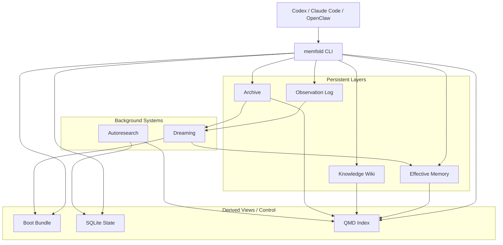

# MemFold 架构设计总览

- 状态：Draft
- 日期：2026-04-11
- 语言：中文工作稿
- 范围：MemFold v1 总体设计导航

这份文件现在只负责总览和导航，不再承载全部细节。详细设计已拆到分层文档中，避免主稿变成一篇过长的连续说明文。

## 核心结论

- MemFold 是一个本地优先、跨项目、跨 session 复用的分层记忆系统。
- 主核心采用 `Rust + CLI-first`，不以 MCP 为主接口。
- 存储采用混合结构：
  - `Markdown`：长期有效记忆与知识页
  - `JSONL`：observation、archive、raw event 投影
  - `SQLite`：状态、索引控制、作业、关系、锁
  - `QMD`：检索 sidecar，不是真相源
- `Boot Layer` 不是独立长期层，而是从 stable memory 编译出的加载视图。
- 默认策略是 `默认少载入、按需下钻、错误记忆不可自动复活`。
- 敏感信息不应进入长期记忆、observation、archive 正文或实验集。

## 文档地图

- [01-system-overview.zh-CN.md](/home/ps/project/MemFold/docs/specs/2026-04-11-memfold/01-system-overview.zh-CN.md)
  系统定位、层级模型、核心术语、边界定义
- [02-loading-and-retrieval.zh-CN.md](/home/ps/project/MemFold/docs/specs/2026-04-11-memfold/02-loading-and-retrieval.zh-CN.md)
  启动加载、三种模式、检索路径、token 控制、错误记忆隔离
- [03-storage-and-qmd.zh-CN.md](/home/ps/project/MemFold/docs/specs/2026-04-11-memfold/03-storage-and-qmd.zh-CN.md)
  SQLite / Markdown / JSONL / QMD 的职责、提交恢复协议、保留期、可移植性
- [04-dreaming-and-autoresearch.zh-CN.md](/home/ps/project/MemFold/docs/specs/2026-04-11-memfold/04-dreaming-and-autoresearch.zh-CN.md)
  observation、reflection note、dreaming phase、自我进化与实验隔离
- [05-runtime-and-implementation.zh-CN.md](/home/ps/project/MemFold/docs/specs/2026-04-11-memfold/05-runtime-and-implementation.zh-CN.md)
  Rust runtime、宿主集成边界、模块拆分、CLI、版本范围
- [memfold-open-source-review.zh-CN.md](/home/ps/project/MemFold/docs/references/memfold-open-source-review.zh-CN.md)
  借鉴来源、license、采用与不采用的部分

## 一图看全局

## 读文建议

- 如果你先看系统边界：从 `01` 开始。
- 如果你最关心上下文污染：先看 `02`。
- 如果你最关心 SQLite 和 QMD 的关系：先看 `03`。
- 如果你最关心 dreaming 和自我进化：先看 `04`。
- 如果你准备进入实现：看 `05`。

## 当前评审状态

这版总览对应的细节文档已经过一轮多视角审阅，重点修正了：

- Boot 是否独立成层
- QMD 是否会过早把 wiki/archive 带入上下文
- fresh/sterile 是否会把错误会话结果回流到长期记忆
- observation 与 reflection note 是否混淆
- 跨存储提交与恢复协议是否缺失
- 敏感数据、保留期、实验隔离是否明确

下一步工作不再是继续往这份总览里堆细节，而是继续迭代分层专题文档。
