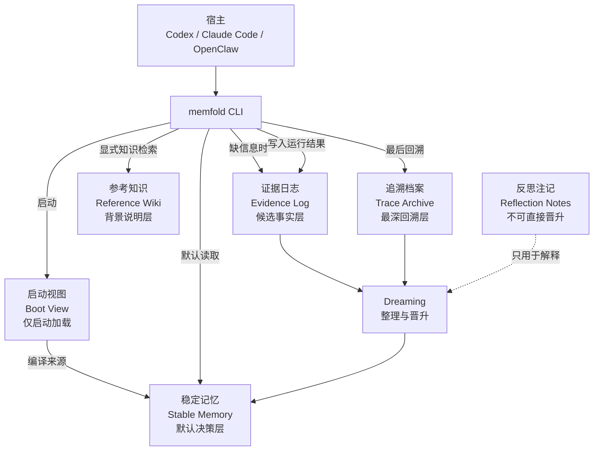

# MemFold 架构设计总览

- 状态：Draft
- 日期：2026-04-11
- 语言：中文工作稿

MemFold 不是“把所有历史都存起来再想办法搜”的系统。\
它的目标是用最少的默认上下文，稳定支持跨项目、跨 session 的 agent 工作。

系统的核心判断只有三条：

1. 默认只读 `稳定记忆`
2. 不够时先查 `证据日志`
3. 还不够才查 `参考知识` 和 `追溯档案`

## 文档结构

- [01-system-overview.zh-CN.md](/home/ps/project/MemFold/docs/specs/2026-04-11-memfold/01-system-overview.zh-CN.md)
  术语、层级、主次关系
- [02-loading-and-retrieval.zh-CN.md](/home/ps/project/MemFold/docs/specs/2026-04-11-memfold/02-loading-and-retrieval.zh-CN.md)
  启动、续做、知识检索、写入四条运行流
- [03-storage-and-qmd.zh-CN.md](/home/ps/project/MemFold/docs/specs/2026-04-11-memfold/03-storage-and-qmd.zh-CN.md)
  真相源、状态层、QMD、跨存储提交与恢复
- [04-dreaming-and-autoresearch.zh-CN.md](/home/ps/project/MemFold/docs/specs/2026-04-11-memfold/04-dreaming-and-autoresearch.zh-CN.md)
  dreaming 语义、错误记忆隔离、20 轮设计迭代
- [05-runtime-and-implementation.zh-CN.md](/home/ps/project/MemFold/docs/specs/2026-04-11-memfold/05-runtime-and-implementation.zh-CN.md)
  CLI、模块、实施阶段
- [memfold-open-source-review.zh-CN.md](/home/ps/project/MemFold/docs/references/memfold-open-source-review.zh-CN.md)
  外部借鉴与 license

## 总体图

## 一句话原则

- `Boot View` 不是一层记忆，只是 `稳定记忆` 的派生视图。
- `稳定记忆` 是默认层，只有这里的内容才有资格长期影响行为。
- `证据日志` 不是长期记忆，它只是给 dreaming 提供正式输入。
- `参考知识` 只用于背景理解，不应覆盖当前任务事实。
- `追溯档案` 是最后一层，不应被默认载入。

