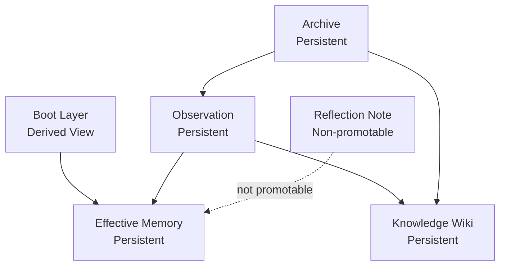

# 01 System Overview

## 1. 目标

MemFold 的目标是为本地 agent 提供一个：

- 默认低噪声
- 可跨项目复用
- 可跨 session 复用
- 可追溯
- 可整理
- 可自评估

的分层记忆系统。

它不追求“尽可能多记”，而追求“尽可能少读但足够准”。

## 2. 非目标

MemFold 不是：

- 通用向量数据库
- 纯 wiki 产品
- 自动保存一切原文的长期档案柜
- 只靠 prompt 堆上下文的记忆增强器
- MCP-first 的常驻协议服务

## 3. 分层模型

## 4. 各层定义

### 4.1 Effective Memory

默认长期记忆层。它承载：

- 用户稳定偏好
- 项目长期约束
- 经过整理和验证的稳定事实

它不是原始材料，也不是模型一次性推理结果。

### 4.2 Observation

结构化证据层。它承载：

- 用户显式表达
- 工具调用结果的摘要化结论
- 代码修改和验证结果
- 设计决策和显式反馈

它是 dreaming 的正式输入，但不是默认上下文。

### 4.3 Archive

安全清洗后的追溯层。它承载：

- `archive summary`
- `archive refs`
- 必要时的 `raw transcript refs`

这里的关键点是：MemFold 不把“无条件保存原始全文”作为默认前提。对系统来说，更重要的是安全引用与可回放，而不是把所有原文永远直接存进主数据层。

### 4.4 Knowledge Wiki

浏览和综述层。它适合放：

- 项目背景页
- 实体页
- 概念页
- 主题页
- 外部资料综述

它不应替代当前轮行为决策。

### 4.5 Boot Layer

Boot Layer 只是加载视图。它从 stable memory 中按规则编译出来，只负责：

- 安全启动
- 最小上下文加载
- 把高频稳定信息控制在小预算内

它不是独立真相源。

### 4.6 Reflection Note

只用于解释和调试的反思性注记。它可记录：

- dreaming 过程中的分析
- 检索路径解释
- 模型的暂时性猜测

默认：

- 不进入 observation
- 不参与 boot 编译
- 不可直接晋升为长期记忆

## 5. 核心术语

### 5.1 Memory Mode

控制会话默认读什么、是否允许自动扩展检索、是否允许写入后续晋升路径。

### 5.2 Autoload

控制 stable memory 是否有资格参与 boot 编译。

建议枚举：

- `none`
- `boot_user`
- `boot_project`
- `manual_only`

### 5.3 User Profile

effective memory 中的用户级受控子集。

### 5.4 Project Card

effective memory 中的项目级受控子集。

### 5.5 Knowledge Lookup

显式知识检索意图。只有在这种意图下，wiki 和 archive summary 才允许前置。

## 6. 核心原则

### 6.1 默认少载入

默认只加载稳定、短、低争议的信息。

### 6.2 分层隔离

长期记忆、结构化观察、追溯材料、知识页必须分层。

### 6.3 文件可审查，状态可查询

- 内容真相源：Markdown + JSONL
- 状态真相源：SQLite
- 检索加速器：QMD

### 6.4 错误记忆不可自动复活

被拒绝的 claim 必须通过语义墓碑阻止自动复活。

### 6.5 敏感信息默认不入记忆

密钥、token、cookie、密码、私钥、助记词、个人隐私、支付信息等不应进入长期记忆、observation、archive 正文、wiki 或 benchmark。

### 6.6 预算优先

只要已有上下文足够支撑回答，就不继续下钻。

## 7. 宿主边界

MemFold 服务于：

- Codex
- Claude Code
- OpenClaw

但不内嵌宿主生命周期。宿主只负责触发：

- load
- search
- write_observation
- feedback
- dream_run

核心系统负责：

- 筛选和加载
- 状态机
- dreaming
- 检索路由
- 自我进化评估

## 8. 这一层文档不讨论什么

本文件只定义系统边界，不展开：

- 三种模式下的读取细则
- QMD 的索引契约
- SQLite 表字段
- dreaming 状态机
- CLI 子命令

这些分别见 `02`、`03`、`04`、`05`。
