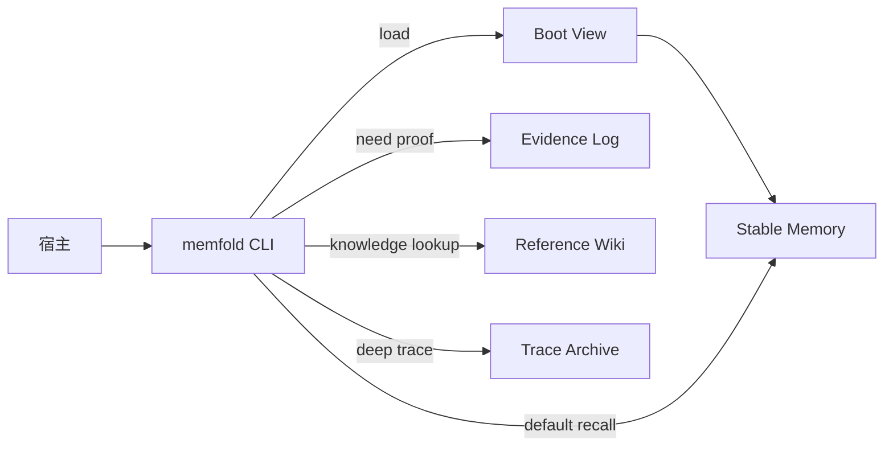

# 01 System Overview

## 1. 系统语义

MemFold 用五个名字描述五种完全不同的东西：

| 名称 | 作用 | 默认是否读取 | 是否长期真相源 |
|------|------|--------------|----------------|
| `Boot View` | 启动时的最小上下文 | 是 | 否 |
| `Stable Memory` | 默认长期记忆 | 是 | 是 |
| `Evidence Log` | 运行中的结构化证据 | 否 | 是 |
| `Reference Wiki` | 背景知识与综述 | 否 | 是 |
| `Trace Archive` | 最深回溯材料 | 否 | 是 |

再加一个特殊对象：

| 名称 | 作用 | 是否可晋升 |
|------|------|------------|
| `Reflection Notes` | 解释、调试、推测 | 否 |

## 2. 主次关系

默认工作时，优先级固定：

1. `Boot View`
2. `Stable Memory`
3. `Evidence Log`
4. `Reference Wiki`
5. `Trace Archive`

这不是“可选顺序”，而是系统的主次关系。

### 为什么这样排

- `Stable Memory` 才是系统默认相信的长期层。
- `Evidence Log` 比 wiki 更接近当前工作事实。
- `Reference Wiki` 更适合解释背景，不适合直接主导当前轮判断。
- `Trace Archive` 成本最高，也最容易带入无关旧信息。

## 3. 调用关系

这个图表达的是“谁先被调用，谁后被调用”，不是数据依赖图。

## 4. 各层边界

### 4.1 Boot View

它只是 `Stable Memory` 的编译结果。  
用途是把启动上下文压到稳定、低噪声、低 token 的范围。

它不是长期真相源，不接受人工长期维护。

### 4.2 Stable Memory

这是系统唯一默认长期影响行为的层。

这里放的应该只有：

- 用户稳定偏好
- 项目长期约束
- 经整理和验证的稳定事实

这里不该放：

- 单次推理结果
- 旧任务路径
- 原始工具输出
- 纯背景综述

### 4.3 Evidence Log

这是当前运行产生的“证据层”。

来源只允许是：

- 用户显式表达
- 工具调用结果
- 代码修改结果
- 测试与验证结果
- 设计决策
- 用户反馈

它的语义很简单：

- 先记下
- 不默认载入
- 等 dreaming 判断是否进入 `Stable Memory`

### 4.4 Reference Wiki

这是背景层，不是决策层。

它适合放：

- 项目综述
- 概念说明
- 实体说明
- 外部资料总结

只有显式 `knowledge lookup` 时才应该前置。

### 4.5 Trace Archive

这是最深回溯层。

它只负责一件事：  
在前面几层都不够时，提供安全清洗后的追溯材料和引用。

它不是“永远保存原始全文”的借口。

### 4.6 Reflection Notes

这是调试层，不是事实层。

它可以记录：

- dreaming 过程中的分析
- 检索路径解释
- 暂时性猜测

但它默认：

- 不进入 `Evidence Log`
- 不参与 boot 编译
- 不可直接晋升为 `Stable Memory`

## 5. 关键约束

### 5.1 默认少载入

只要 `Stable Memory` 足够，就不继续下钻。

### 5.2 错误记忆不可自动复活

被拒绝的 claim 必须由语义墓碑拦住，不能换个 summary 或换组证据后自动回来。

### 5.3 敏感信息默认不入记忆

密钥、token、cookie、密码、私钥、助记词、PII、支付信息等不能进入：

- `Stable Memory`
- `Evidence Log`
- `Reference Wiki`
- `Trace Archive` 正文
- benchmark 和实验集

### 5.4 文件可审查，状态可查询

- 内容真相源：`Markdown + JSONL`
- 状态真相源：`SQLite`
- 检索加速器：`QMD`

## 6. 宿主边界

MemFold 服务于：

- Codex
- Claude Code
- OpenClaw

但不嵌进宿主生命周期。  
宿主只做触发，MemFold 负责真正的加载、筛选、整理和回溯。
