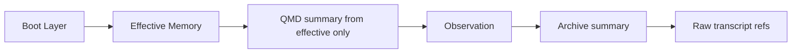

# 02 Loading And Retrieval

## 1. 设计目标

这部分只解决一个问题：

如何在尽量少花 token 的前提下，让 agent 拿到足够正确的上下文。

核心原则：启动少载入、自动扩展极少、source-aware 检索、错误记忆不可自动回流。

## 2. Boot Bundle

Boot 不整段读取多个文件，而是读取编译后的 `boot bundle`。

### 2.1 默认内容

默认只包含两类：

- `User Profile`
- `Project Card`

### 2.2 禁止进入 Boot 的内容

- 上一轮推理过程
- 上一轮错误路径
- 低置信 observation
- candidate memory
- disputed / rejected / quarantined memory
- raw transcript
- 大段旧 session 总结
- reflection note

### 2.3 预算与 slot

建议预算：

- `normal`：300 到 700 tokens，硬上限 900
- `fresh`：60 到 180 tokens，硬上限 250
- `sterile`：0

建议 slot：

- 语言偏好：1
- 风格偏好：2
- 用户硬约束：3
- 项目身份：1
- 项目术语映射：5 对
- 关键入口：3
- 项目长期约束：3

### 2.4 编译资格

只有同时满足以下条件才可入 boot：

- `status = stable`
- `autoload = boot_user | boot_project`
- `confidence` 达阈值
- `trust_score` 达阈值
- `freshness_score` 达阈值
- 未过期
- 不在冲突窗口中

## 3. 会话模式

### 3.1 模式矩阵

| 模式 | 读 boot | 自动扩展检索 | 写 observation | 进入 dreaming | 自动晋升 |
|------|---------|--------------|----------------|---------------|----------|
| `normal` | 是 | 是，受预算和门控限制 | 是 | 是 | 是 |
| `fresh` | 是，最小集 | 否，除非显式请求 | 是，带 `origin_mode=fresh` | 默认否 | 否 |
| `sterile` | 否 | 否 | 可选，仅安全清洗摘要 | 否 | 否 |

### 3.2 模式语义

- `normal`
  - 默认模式
  - 允许有限度自动回忆
- `fresh`
  - 为“重新开始但保留最小用户画像”准备
  - 不允许因相似查询自动拉起旧记忆
- `sterile`
  - 为彻底隔离错误方向准备
  - 不做任何隐式回忆

当用户明确要求“重新开始”或“不要沿用之前判断”时，应优先切换到 `fresh` 或 `sterile`。

## 4. 自动扩展触发器

只有以下场景允许自动扩展读取：

- 用户显式要求继续上次工作
- 用户提到“按我一贯习惯”“你之前记得”
- 当前上下文出现冲突或缺信息
- 用户明确指出理解偏差，要求回溯对齐
- 用户显式发起知识检索或背景查询

这些不构成自动扩展理由：项目匹配、主题匹配、实体名字相似。

## 5. 默认检索路径

这条路径用于默认续做和行为决策。

约束：

- `wiki` 和 `archive` 默认不能早于 `observation`
- `QMD` 在 `normal/fresh` 下默认只查询 `effective` collection
- 单轮默认最多一次隐式扩展

## 6. 显式知识检索路径

这条路径只在 `knowledge_lookup` 意图下启用，用于背景综述和主题查阅，不用于默认行为决策。

## 7. Source Gating

### 7.1 默认 source gating

- `normal` / `fresh`
  - QMD 默认只查 `effective`
- `knowledge_lookup`
  - 允许查 `wiki`
  - 必要时再查 `archive`
- `sterile`
  - 不走长期记忆和隐式检索

### 7.2 返回结果的最小 metadata

每条检索结果至少带：

- `source_type`
- `updated_at`
- `status_or_trust`
- `scope`
- `doc_id`
- `content_hash`
- `pointer`

结果不得裸注入 prompt。

## 8. Progressive Disclosure

检索输出分三层：

- `summary`
  - 最短摘要，可内联
- `context`
  - 中等长度，补背景
- `details`
  - 深度材料，仅显式下钻使用

### 8.1 token 预算

- `summary`：80 到 180 tokens
- `context`：最多 300 tokens
- `details`：只在显式下钻时使用

默认同一轮不应同时拼接多组 `context` 和 `details`。

## 9. 错误记忆隔离

### 9.1 状态

- `stable`
- `candidate`
- `disputed`
- `rejected`
- `quarantined`

### 9.2 语义墓碑

单纯把 item 标成 `rejected` 不够。必须建立：

- `claim_fingerprint`
- `tombstones`

规则：

- 与 tombstone 高相似的新 candidate 不能直接晋升
- 恢复被拒绝 claim 需要新的证据链和显式复核

## 10. fresh / sterile 的写侧隔离

这是防污染的关键。

- `fresh`
  - observation 默认 `non_promotable_until_review`
- `sterile`
  - observation 默认不进入 dreaming 队列
  - 临时 archive 材料必须可一键清理

这样用户用“干净会话”纠正方向时，不会把同一批错误材料再次通过后台整理写回长期记忆。

## 11. 稳定载入验收
在同一快照、同一 `mode/scope/intent` 下，连续两次 `load` 必须得到：
- 相同 item 集合
- 相同顺序
- 相同 token 预算裁剪结果
当存在未完成 mutation 时，load 要么等待稳定点，要么显式降级；禁止部分可见。

最小失败样例：

- `mutation` 已写状态层、未写内容层
- 内容层已落地、boot 未重编
- `fresh` 会话错误读到旧项目记忆
- `sterile` 会话隐式触发长期记忆检索
