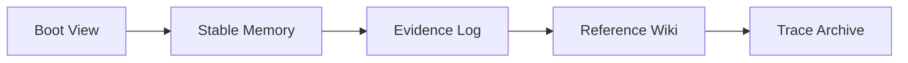

# 02 Loading And Retrieval

## 1. 本文解决什么问题

这份文档只回答两件事：

1. MemFold 在什么顺序下读记忆
2. 什么时候允许继续往下读

目标不是“尽量多读”，而是“用最少上下文拿到足够正确的依据”。

## 2. Boot View

Boot View 是从 `Stable Memory` 编译出来的启动视图，不是独立真相源。

默认只允许进入两类内容：

- `User Profile`
- `Project Card`

默认禁止进入：

- 单次推理过程
- 旧任务路径
- 低置信证据
- candidate / disputed / rejected / quarantined 条目
- 追溯档案正文
- 反思注记

建议预算：

- `normal`：300 到 700 tokens，硬上限 900
- `fresh`：60 到 180 tokens，硬上限 250
- `sterile`：0

## 3. 会话模式

| 模式 | 读 Boot | 自动扩展检索 | 写证据 | 进入 Dreaming | 自动晋升 |
|------|---------|--------------|--------|---------------|----------|
| `normal` | 是 | 是，受预算和门控限制 | 是 | 是 | 是 |
| `fresh` | 是，最小集 | 否，除非显式请求 | 是，带 `origin_mode=fresh` | 默认否 | 否 |
| `sterile` | 否 | 否 | 可选，仅安全清洗摘要 | 否 | 否 |

语义：

- `normal`：正常工作模式
- `fresh`：重新开始，但保留最小用户画像
- `sterile`：完全隔离旧记忆

当用户明确说“重新开始”或“不要沿用之前判断”时，应切到 `fresh` 或 `sterile`。

## 4. 默认读取顺序

说明：

- `Stable Memory` 是默认决策层
- `Evidence Log` 是当前工作最接近事实的下一层
- `Reference Wiki` 只用于背景理解
- `Trace Archive` 是最后的深回溯层

## 5. 什么情况下允许继续往下读

只有以下场景允许自动扩展：

- 用户显式要求继续上次工作
- 用户提到“按我一贯习惯”“你之前记得”
- 当前上下文出现冲突或缺信息
- 用户明确指出理解偏差，要求回溯对齐
- 用户显式发起知识检索或背景查询

以下情况不构成自动扩展理由：

- 只是项目名匹配
- 只是主题相似
- 只是实体名相似

## 6. 默认工作流与知识检索工作流

### 6.1 默认工作流

用于续做和行为决策：

1. `Boot View`
2. `Stable Memory`
3. `Evidence Log`
4. `Reference Wiki`
5. `Trace Archive`

这里的硬约束是：

- `Reference Wiki` 不能早于 `Evidence Log`
- `Trace Archive` 不能因为一次模糊搜索就进入上下文

### 6.2 知识检索工作流

只在 `knowledge_lookup` 意图下启用：

1. `Boot View`
2. `Stable Memory`
3. `Reference Wiki`
4. `Trace Archive`
5. `Evidence Log`

原因很简单：

- 知识检索的目标是背景和综述
- 不是立即推进当前任务动作

## 7. Source Gating

默认规则：

- `normal` / `fresh`
  - 只隐式查 `Stable Memory`
  - `Reference Wiki` 和 `Trace Archive` 需要显式意图
- `knowledge_lookup`
  - 可查 `Reference Wiki`
  - 必要时再查 `Trace Archive`
- `sterile`
  - 不走长期记忆和隐式检索

返回结果必须带最少 metadata：

- `source_type`
- `updated_at`
- `status_or_trust`
- `scope`
- `doc_id`
- `content_hash`
- `pointer`

结果不能裸注入 prompt。

## 8. Progressive Disclosure

检索输出分三档：

- `summary`
- `context`
- `details`

预算建议：

- `summary`：80 到 180 tokens
- `context`：最多 300 tokens
- `details`：仅显式下钻时使用

默认一轮回答不应同时拼接多组 `context` 和 `details`。

## 9. 错误记忆隔离

状态：

- `stable`
- `candidate`
- `disputed`
- `rejected`
- `quarantined`

仅靠 item 状态不够，还必须有：

- `claim_fingerprint`
- `tombstones`

这保证被拒绝的 claim 不能换 summary 或换证据后自动回来。

## 10. 稳定载入验收

同一快照、同一 `mode/scope/intent` 下，连续两次 `load` 必须得到：

- 相同 item 集合
- 相同顺序
- 相同 token 裁剪结果

并且：

- 未完成 mutation 时禁止部分可见
- `fresh` 不得隐式读旧项目记忆
- `sterile` 不得隐式触发长期记忆检索
