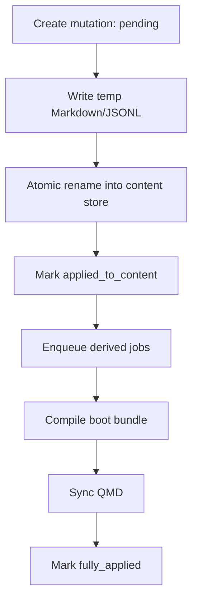

# 03 Storage And QMD

## 1. 存储角色

| 组件 | 角色 | 是否真相源 |
|------|------|------------|
| `Markdown` | effective memory / wiki / profile / project card | 是 |
| `JSONL` | observation log / archive / raw event projection | 是 |
| `SQLite` | 状态、关系、分数、作业、锁、索引控制 | 是，仅限状态 |
| `boot bundle` | 启动加载视图 | 否，派生物 |
| `QMD index` | 检索 sidecar | 否，派生缓存 |

硬规则：

- 内容真相源：`Markdown + JSONL`
- 状态真相源：`SQLite`
- 派生层：`boot bundle + QMD`

## 2. 目录结构

```text
MemFold/
├── memory/
│   ├── user/
│   │   ├── effective/
│   │   ├── boot/
│   │   ├── wiki/
│   │   └── archive/
│   ├── projects/<project-slug>/
│   │   ├── effective/
│   │   ├── boot/
│   │   ├── wiki/
│   │   ├── archive/
│   │   └── sessions/<session-id>/
│   │       ├── observations.jsonl
│   │       └── raw-events.jsonl
├── state/memfold.db
├── state/backups/
├── qmd/config/
├── qmd/collections/
└── runtime/{locks,jobs,cache}/
```

说明：

- `boot/bundle.md` 是派生物，不是人工真相源
- `runtime/locks/` 只用于诊断，不是锁真相源

## 3. Observation 与 Memory Item

### 3.1 Observation 的真相源

- observation 正文真相源：append-only JSONL
- SQLite：observation 的投影、状态、关系、分数

### 3.2 Memory Item 的最小单位

第一版把一个 memory item 定义为：

- 一个 Markdown 文件中的一个稳定 block

每个 block 至少带：

- `item_key`
- `title`
- `summary/body`

因此：

- `file_path` 定位文件
- `item_key` 定位文件内条目
- `content_hash` 检测人工修改
- `revision / supersedes_id / deleted_at` 表示版本链

## 4. SQLite 关键表

核心表只保留职责，不在这里展开字段大全：

- `memory_items`
- `observations`
- `archives`
- `memory_links`
- `dream_jobs`
- `promotion_candidates`
- `feedback_events`
- `retrieval_events`
- `mutations`
- `sessions`
- `lock_leases`
- `tombstones`

关键含义：

- `mutations`：跨存储变更协议
- `lock_leases`：唯一锁真相源
- `tombstones`：claim 级拒绝

## 5. 锁与并发

锁真相源只允许一个：

- `SQLite lease`

最小锁字段：

- `lock_key`
- `owner`
- `lease_until`
- `heartbeat_at`
- `idempotency_key`

适用命令：

- `write_observation`
- `dream_run`
- `bundle_compile`
- `qmd_sync`
- `repair`

## 6. 跨存储提交与恢复协议



提交顺序：

1. 在 `SQLite` 创建 mutation，状态 `pending`
2. 生成目标内容到临时文件
3. 原子 rename 替换目标文件
4. mutation 更新为 `applied_to_content`
5. 生成 `pending_bundle_compile` 和 `pending_qmd_sync`
6. 派生步骤完成后标记 `fully_applied`

恢复规则：

- 启动时扫描未完成 mutation
- 内容已落地但派生层未完成，只补派生步骤
- 内容落地不完整，回滚到前一版本

`repair` 优先级固定为：

`content store -> SQLite projection -> derived layers`

## 7. QMD 的边界

QMD 是检索 sidecar，不是状态真相源。

QMD 负责：

- `effective` / `wiki` / `archive` 索引
- path/topic/collection 查询

QMD 不负责：

- 状态迁移
- 自动加载决策
- 冲突处理
- dreaming 决策
- rejected/quarantine 管理
- 跨存储提交事务

## 8. QMD 文档模型契约

QMD 文档至少包含：

- `doc_id`
- `source_type`
- `relative_path`
- `pointer`
- `content_hash`
- `last_indexed_at`

要求：

- `pointer` 必须能稳定回指真相源
- `relative_path` 必须是 canonical relative path
- QMD 索引始终视为可丢弃重建缓存

## 9. 可移植性

为了可搬迁、可 fork、可恢复：

- 状态中只存 canonical relative path
- 同时存 `content_hash`
- 不把绝对路径写进主状态
- 不依赖宿主临时目录

## 10. 保留期与删除传播

最小 retention 规则：

- `boot bundle`：只保留当前编译结果
- `effective memory`：长期保留，superseded 版本不自动加载
- `observation`：长期但可清理
- `archive`：可保留，但必须可删改和裁剪
- `experiment artifacts`：短期保留
- `backups`：必须 prune

删除或脱敏必须同步传播到：

- SQLite 投影
- QMD 索引
- benchmark
- backup
- cache

`sterile` 产生的材料必须可一键清理。
