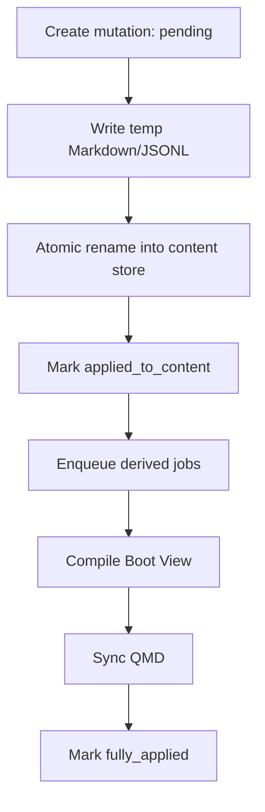

# 03 Storage And QMD

## 1. 存储分工

| 组件 | 职责 | 是否真相源 |
|------|------|------------|
| `Markdown` | Stable Memory / Reference Wiki / Profile / Project Card | 是 |
| `JSONL` | Evidence Log / Trace Archive / Raw Event Projection | 是 |
| `SQLite` | 状态、关系、分数、作业、锁 | 是，仅限状态 |
| `Boot View` | 启动视图 | 否，派生物 |
| `QMD` | 检索 sidecar | 否，派生缓存 |

硬规则：

- 内容真相源：`Markdown + JSONL`
- 状态真相源：`SQLite`
- 派生层：`Boot View + QMD`

## 2. 目录结构

```text
MemFold/
├── memory/
│   ├── user/
│   │   ├── stable/
│   │   ├── boot/
│   │   ├── wiki/
│   │   └── archive/
│   ├── projects/<project-slug>/
│   │   ├── stable/
│   │   ├── boot/
│   │   ├── wiki/
│   │   ├── archive/
│   │   └── sessions/<session-id>/
│   │       ├── evidence.jsonl
│   │       └── raw-events.jsonl
├── state/memfold.db
├── qmd/
└── runtime/
```

说明：

- `boot/` 是派生目录
- `runtime/locks/` 若存在，只用于诊断，不是锁真相源

## 3. Evidence Log 与 Memory Item

### 3.1 Evidence Log 的真相源

- evidence 正文真相源：append-only JSONL
- SQLite：evidence 的投影、状态、关系、分数

### 3.2 Memory Item 的最小单位

一个 memory item = 一个 Markdown 文件中的一个稳定 block。

每个 block 至少有：

- `item_key`
- `title`
- `summary/body`

因此：

- `file_path` 定位文件
- `item_key` 定位文件内条目
- `content_hash` 检测人工修改
- `revision / supersedes_id / deleted_at` 表示版本链

## 4. SQLite 的职责

SQLite 存状态，不存唯一正文真相源。

最关键的表：

- `memory_items`
- `evidence_items`
- `trace_archives`
- `mutations`
- `sessions`
- `lock_leases`
- `tombstones`

重点：

- `mutations`：跨存储变更协议
- `lock_leases`：唯一锁真相源
- `tombstones`：claim 级拒绝

## 5. 锁与并发

锁真相源只允许一个：

- `SQLite lease`

最小字段：

- `lock_key`
- `owner`
- `lease_until`
- `heartbeat_at`
- `idempotency_key`

适用命令：

- `write_evidence`
- `dream_run`
- `bundle_compile`
- `qmd_sync`
- `repair`

## 6. 跨存储提交与恢复



顺序固定：

1. SQLite 建 mutation
2. 内容层写临时文件
3. 原子替换内容层
4. mutation 标记为 `applied_to_content`
5. 生成 boot/QMD 派生作业
6. 派生完成后标记 `fully_applied`

恢复规则：

- 启动先扫未完成 mutation
- 内容已落地但派生未完成，只补派生步骤
- 内容落地不完整，回滚到前一版本

`repair` 顺序固定为：

`content store -> SQLite projection -> derived layers`

## 7. QMD 的边界

QMD 是检索 sidecar，不是状态真相源。

QMD 负责：

- `stable` / `reference-wiki` / `trace-archive` 索引
- path/topic/collection 查询

QMD 不负责：

- 状态迁移
- 自动加载决策
- 冲突处理
- dreaming 决策
- 跨存储提交事务

## 8. QMD 文档契约

QMD 文档至少带：

- `doc_id`
- `source_type`
- `relative_path`
- `pointer`
- `content_hash`
- `last_indexed_at`

要求：

- `pointer` 能稳定回指真相源
- `relative_path` 必须是 canonical relative path
- QMD 始终可丢弃重建

## 9. 索引检索验收

第一版的最低门槛：

- 热路径精确查找：`p50 < 50ms`，`p95 < 150ms`
- 常规混合检索：`p50 < 150ms`，`p95 < 400ms`
- 全量重建必须可执行
- 增量同步不得破坏稳定回指

最小失败样例：

- rename 后回指失效
- 删除或脱敏后旧索引仍命中
- 增量同步后同一内容重复命中
- QMD 可用但 SQLite 状态缺失时，结果仍被误当稳定记忆

## 10. 可移植性与删除传播

为了可搬迁、可恢复：

- 主状态只存 canonical relative path
- 同时存 `content_hash`
- 不把绝对路径写进主状态

删除或脱敏必须同步传播到：

- SQLite 投影
- QMD 索引
- benchmark
- backup
- cache

`sterile` 产生的临时材料必须可一键清理。
