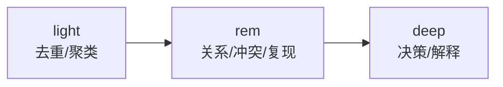
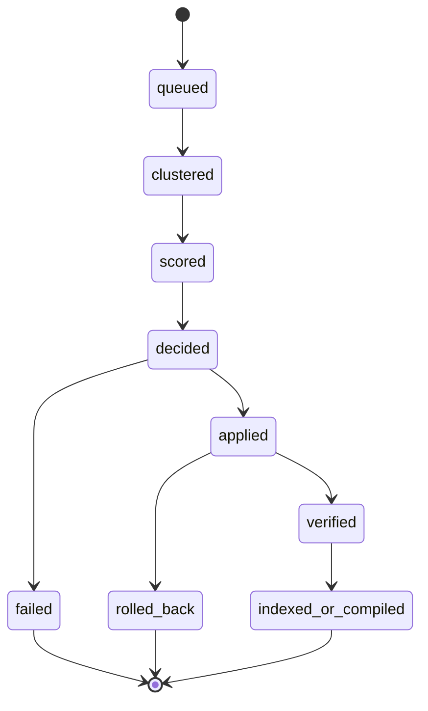

# 04 Dreaming And Autoresearch

## 1. Observation Ingress Gate

Observation 写入前必须经过安全清洗：

- 密钥与 token 识别
- cookie / session 识别
- 私钥 / 助记词识别
- 明显 PII 识别
- 长文本截断与摘要化
- 高风险原文替换为标签或外部引用

无法确认是否敏感时，默认不写 observation 正文。

## 2. Observation 与 Reflection Note

Observation 的合法来源：

- 用户显式表达
- 工具调用结果
- 代码修改结果
- 测试/验证结果
- 设计决策
- 用户反馈

Reflection Note 只记录：

- 模型猜测
- dreaming 反思
- 未绑定证据的总结
- 检索路径解释

默认规则：

- Reflection Note 不进入 boot
- Reflection Note 不可直接晋升
- Dreaming 不直接消费 Reflection Note

## 3. Dreaming 的职责

Dreaming 只负责：

- observation 去重
- 主题聚类
- 跨 session 复现信号强化
- 冲突识别
- `promote / merge / demote / reject / quarantine`

它不负责直接编造新事实。

## 4. Dreaming 阶段

- `light`：去重、聚类、基本主题归并
- `rem`：强化复现、识别关系、检测冲突
- `deep`：给出决策并写 explain

## 5. Dreaming 输入

正式输入只有：

- `promotable = true` 的 observation
- 安全清洗后的 archive 摘要
- 已有 stable memory 的比较项

不消费：

- reflection note
- raw 敏感正文
- sterile 模式下默认产出的临时 observation

## 6. Dreaming 状态机

约束：

- 幂等
- 可追踪
- 可回滚
- 单次失败不污染 stable memory

## 7. Promotion 评分维度

- 跨 session 复现次数
- 用户显式确认
- 查询命中频次
- 正向反馈
- 项目相关性
- 实体丰富度
- 最近验证时间
- 冲突惩罚
- 时效衰减
- 被否决历史

## 8. 错误记忆隔离

触发条件：

- 用户明确说“这个不对”
- 用户要求“忽略上次结论”
- 当前事实与 stable memory 冲突
- retrieval 后负反馈集中出现

处理动作：

- 标记为 `disputed` 或 `rejected`
- 从 boot 编译源移除
- 写入 claim tombstone
- 下调关联 observation 信任

恢复要求：

- 新证据链
- 显式复核

## 9. Autoresearch

Autoresearch 只优化策略，不直接替代生产路径。它可以调整：

- observation 写入条件
- 检索路由顺序
- boot 编译策略
- dreaming 阈值和评分

实验闭环：

1. `modify`
2. `verify`
3. `keep or discard`
4. `repeat`

## 10. 实验环境硬隔离

`memfold experiment run` 必须：

- 基于只读内容快照
- 使用独立 SQLite 状态路径
- 使用独立 QMD collection / 索引路径
- 不允许调用生产写入命令
- 不允许改 live memory 文件
- 不允许改生产 boot bundle

策略进生产必须走显式 promote。

## 11. 评估指标

### 11.1 hard gate

- `false_memory_rate`
- `contradiction_rate`
- `boot_pollution_rate`

任一超阈值，不得进生产。

### 11.2 soft objective

- `useful_recall_at_k`
- `promotion_precision`
- `promotion_recall`
- `token_cost`
- `latency`

### 11.3 记录要求

每次实验必须记录：

- 样本量
- 基线版本
- 切片结果
- 通过/失败原因

## 12. 回放样本边界

Autoresearch 默认只处理：

- 脱敏后的回放样本
- 已标注 benchmark
- 受控实验数据

不应把生产中的完整用户记忆正文拿去做自由试验。
