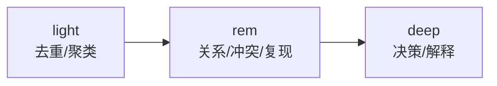
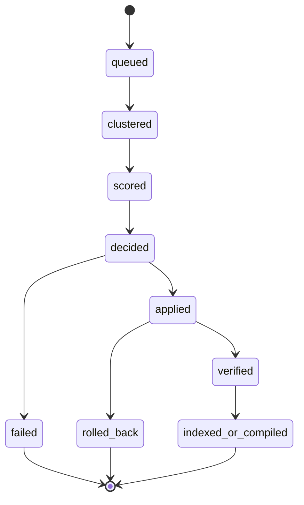

# 04 Dreaming And Autoresearch

## 1. Dreaming 的语义

Dreaming 不是“模型自由发挥”，而是把 `Evidence Log` 整理成 `Stable Memory` 的过程。

它的输入只能是：

- 可晋升的证据
- 安全清洗后的追溯摘要
- 现有稳定记忆的比较项

它不能直接消费：

- `Reflection Notes`
- 原始敏感正文
- `sterile` 模式下默认产生的临时证据

## 2. Evidence Ingress Gate

证据写入前必须先过安全闸门：

- 密钥与 token 识别
- cookie / session 识别
- 私钥 / 助记词识别
- PII 识别
- 长文本截断与摘要化
- 高风险原文替换为标签或引用

无法判断是否敏感时，默认不写证据正文。

## 3. Evidence 与 Reflection Notes

Evidence 的合法来源：

- 用户显式表达
- 工具调用结果
- 代码修改结果
- 测试 / 验证结果
- 设计决策
- 用户反馈

Reflection Notes 只记录：

- 模型猜测
- dreaming 过程分析
- 检索路径解释

默认规则：

- `Reflection Notes` 不进入 boot
- `Reflection Notes` 不可直接晋升
- `Dreaming` 不直接消费 `Reflection Notes`

## 4. Dreaming 的阶段

阶段职责：

- `light`：把证据收成清晰的候选簇
- `rem`：判断复现、关系和冲突
- `deep`：给出 `promote / merge / demote / reject / quarantine`

## 5. Dreaming 状态机

约束：

- 幂等
- 可追踪
- 可回滚
- 单次失败不污染稳定记忆

## 6. 错误记忆隔离

触发条件：

- 用户明确说“这个不对”
- 用户要求“忽略上次结论”
- 当前事实与稳定记忆冲突
- retrieval 后负反馈集中出现

处理动作：

- 标记为 `disputed` 或 `rejected`
- 从 boot 编译源移除
- 写入 claim tombstone
- 下调关联证据信任

恢复要求：

- 新证据链
- 显式复核

## 7. 能力验收

### 7.1 错误记忆不可复活

失败样例：

- 换 summary 重新晋升
- 换证据重新晋升

通过门槛：

- 被 tombstone 命中的 claim 自动晋升率为 0

### 7.2 Dreaming 不自我污染

失败样例：

- `Reflection Notes` 被当成 evidence 晋升

通过门槛：

- 纯反思输入的晋升率为 0

### 7.3 敏感信息不入库

失败样例：

- token / cookie / private key 出现在 JSONL、Markdown、SQLite、QMD、benchmark

通过门槛：

- 原文泄漏率为 0

## 8. Autoresearch 的语义

Autoresearch 不直接改生产记忆，它只优化“记忆系统自己的策略”。

它可以优化：

- 证据写入条件
- 检索路由顺序
- boot 编译策略
- dreaming 阈值和评分

## 9. 实验环境隔离

`memfold experiment run` 必须：

- 基于只读内容快照
- 使用独立 SQLite 状态路径
- 使用独立 QMD 索引路径
- 不允许改 live memory 文件
- 不允许改生产 boot

策略进生产必须走显式 promote。

## 10. 20 轮设计迭代

这 20 轮不是 20 次随意改稿，而是 20 次围绕失败样例和门槛的定向迭代。

### 10.1 加载与污染

1. boot 编译规则
2. mode 隔离
3. source gating
4. token 裁剪
5. 错误记忆复活防护

### 10.2 索引与回指

6. QMD 文档模型
7. 热路径查询
8. 增量同步
9. 全量重建
10. rename/delete 后回指稳定性

### 10.3 跨存储一致性

11. mutation 状态机
12. 崩溃恢复
13. repair 顺序
14. 锁与并发
15. 备份与恢复

### 10.4 Dreaming 与安全

16. evidence ingress gate
17. reflection 隔离
18. promotion precision
19. redaction propagation
20. experiment/prod hard isolation

每一轮都必须产出：

- 失败样例
- 当前机制
- 验收方法
- 通过 / 失败结果
